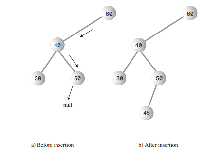
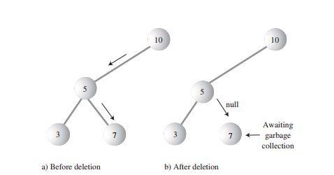

# Binary Tree
Binary trees combines the advantages of two other structures: an
ordered array and a linked list. You can search a tree
quickly, as you can an ordered array, and you can also
insert and delete items quickly, as you can with a linked
list. A tree consists of nodes connected by edges. Figure below shows a tree. In such a picture
of a tree the nodes are represented as circles, and the
edges as lines connecting the circles. 

### A general (non-binary) tree.

In computer programs, nodes often represent such entities as people, car parts,
airline reservations, and so on—in other words, the typical items we store in any
kind of data structure. In an OOP language like Java these real-world entities are
represented by objects.
The lines (edges) between the nodes represent the way the nodes are related.
Roughly speaking, the lines represent convenience: It’s easy (and fast) for a program
to get from one node to another if there is a line connecting them. In fact, the only
way to get from node to node is to follow a path along the lines. Generally, you are
restricted to going in one direction along edges: from the root downward. 
If every node in a tree can have at most two children, the tree is called a binary tree.
In this chapter we’ll focus on binary trees because they are the simplest and the most
common.

### Methods:
* `insert`
* `delete`
* `find`
* `inOrder`
* `maximum`
* `minimum`

### The `find()` Method

### The `insert()` Method

### The `delete()` Method

### The `inOrder()` Method

### Linked-List Efficiency
Most operations with trees involve descending the tree from level to
level to find a particular node. How long does it take to do this? In a full tree, about
half the nodes are on the bottom level. (More accurately, if it’s full, there’s one more
node on the bottom row than in the rest of the tree.) Thus, about half of all searches
or insertions or deletions require finding a node on the lowest level. (An additional
quarter of these operations require finding the node on the next-to-lowest level, and
so on.)

During a search we need to visit one node on each level. So we can get a good idea
how long it takes to carry out these operations by knowing how many levels there
are. Assuming a full tree, table below shows how many levels are necessary to hold a
given number of nodes.

| Number of Nodes| Number of Levels|
| --- | --- |
| 1 | 1 |
| 3 | 2 |
| 7 | 3 |
| 15 | 4 |
| 31 | 5 |
| … |…|
| 1,023 | 10 |
| … | … |
| 32,767 | 15 |
| … | … |
| 1,048,575 | 20 |
| … | … |
| 33,554,432 | 25 |
| … | … |
| 1,073,741,824 | 30 |

In that
case, the number of comparisons for a binary search was approximately equal to the
base 2 logarithm of the number of cells in the array. Here, if we call the number of
nodes in the first column N, and the number of levels in the second column L, we
can say that N is 1 less than 2 raised to the power L, or 
N = 2L – 1

Adding 1 to both sides of the equation, we have
**N + 1 = 2L**

This is equivalent to
**L = log2(N + 1)**

Thus, the time needed to carry out the common tree operations is proportional to
the base 2 log of N. In Big O notation we say such operations take **O(logN)** time.